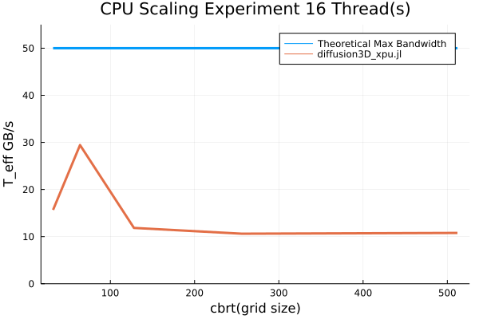

# Part 1: 3D multi-XPUs diffusion solver

The goal of this part is to implement the 3D diffusion equation:


using the dual-time method where the physical time-derivative (dt) is defined as physical term and we use pseudo-time (&tau;) to iterate the solution:


And we are also interested in a steady state solution:


In both cases will also make use of acceleration/damping to enforce scaling of the pseudo-transient iterations.


The next goal is to implement a version of this PDE solution that can run on multiple CPUs and/or GPUs, on a single Computer or even a distributed system. For this task we will make use of [ParallelStencil.jl](https://github.com/omlins/ParallelStencil.jl) which enables us to write code that can be deployed both on a CPU or a GPU (or short XPU). Also we will use [ImplicitGlobalGrid.jl](https://github.com/eth-cscs/ImplicitGlobalGrid.jl) for distributed parallelization (using MPI) of the XPU solution.

Using the different implementations we will then perform some performance test and also do some scaling experiments.

## Methods

### (Pseudo) Temporal Discretation
As previously stated, the goal is to solve the linear diffusion equation in 3 Dimensions using the dual-time method, where the physical time-derivative (dt) is defined as physical term and we use pseudo-time (&tau;) to iterate the solution:


Which implies the following (pseudo-time) discretisation:


For practical purposes we divide the solution into 3 steps. 
1. First we Calculate `H_Res`: 


And in the case where we want to get the steady state solution, we calculate `H_Res` this way:


2. Since we use damping, we update `dH/dτ` in the seccond step with a damping parameter:


3. Finally we update `H`:


<details>
<summary><strong>Sidenote on Numerical Differentiation</strong></summary>

We used the `FiniteDifferences3D` submodule from [ParallelStencil.jl](https://github.com/omlins/ParallelStencil.jl) for the numerical differentiation. Like the name suggests, this submodule provides numerical differentiation via the [Finite Differences Method](https://en.wikipedia.org/wiki/Finite_difference_method).

Here is an example of a pratial numerical derivation of `H` in direction `x`: 


Equivalently here is a pratial numerical 2nd derivation of `H` in direction `x`: 


Using this submodule provied us with the following abstraction:


And thus the 2nd derivative of `H` in direction `x` can be written as:


</details>


### Optimizations and Spatial Discretation
To optimize we will replace all divisions with inverse multiplications, since multiplication is much faster than division.
Also we will transform the equation so we get the least amount of operations possible. Ans precompute values where possible.
So lets look again at `ResH`:


And since we solve this Equation in 3 Dimentions, we get this equivalent formula:


Then we use the abstraction described in the Numerical Differentiation sidenote to discretize the PDE in the spatial domain:


And now the optimizations described above are pretty straight forward:


Since we cant really optimize the other to steps, we now have the following three calculation steps in each iteration:

```julia 
# Step 1 (dual time)
@all(ResH) = -(@inn(H) - @inn(Hold)) * _dt + (@d2_xi(H)*D_dx² + @d2_yi(H)*D_dy² + @d2_zi(H)*D_dz²)

# Step 1 (steady state, only pseudo time)
@all(ResH) = @d2_xi(H)*D_dx² + @d2_yi(H)*D_dy² + @d2_zi(H)*D_dz²

# Step 2
@all(dHdt) = @all(ResH) + damp * @all(dHdt)

# Step 3
@inn(H) = @inn(H) + dτ * @all(dHdt)
```


### Solution approach

As the name "dual-time" suggests, we iterate over 2 types of times. The physical time and the pseudo time.
In this case the physical timestep and the total physical time is given by: `dt = 0.2` and `ttot = 1.0` (both in seconds).
So we iterate over the physical time and in each physical timestep `t` we iterate over the pseudo time &tau; until the L2-norm of the equation's residual `(norm(ResH)/sqrt(length(ResH))` is smaller then the absolute tolerance given by: `tol = 1e-8`. Then we increment `t` by `dt` and update H\^t with the value of H\^&tau; And if `t < ttot` we start the pseudo time loop again. Here is a code snippet that illustrates the dual time loop:

```julia 
#(...)
t = 0

# Physical time loop
while t<ttot

    it_τ = 0

    # Pseudo-transient iteration
    while err>tol && it_τ<itMax
        
        # Calculate ResH, dHdt and H
        #(...)
        
        # Calculate error
        #(...)

        it_τ += 1
    end

    # update physical time step
    t += dt

    #(...)
end
#(...)
```

And if we just want the steady state solution, we just need the pseudo-transient iteration loop:

```julia 
#(...)
it_τ = 0

# Pseudo-transient iteration
while err>tol && it_τ<itMax

    # Calculate ResH, dHdt and H
    #(...)

    # Calculate error
    #(...)

    it_τ += 1
end
#(...)
```

### Hardware

The hardware used to perform all simultaions and scaling experiments:
  - CPU: Intel® Core™ i7-11700 (8C16T, T_peak=50GB/s [[1]](#1))
  - GPU: NVIDIA GeForce RTX 3060 (T_peak=360 GB/s, 199 GFLOPS (FP64) [[2]](#2))

Except for the Multi GPU Experiment, where we used:
  - Multi-GPU Node: 4x NVIDIA GeForce GTX TITAN X (T_peak=480 GB/s, 209 GFLOPS (FP64) [[3]](#3))

## Results

**Dual Time Solution with grid size 512x512x256 - slice at z=128 - using 4 Titan X**


Generated by executing: `julia -O3 --check-bounds=no -t 4 ./scripts-part1/diffusion3D_visualize.jl`.

### Performance
We are using the [performance metric](https://github.com/omlins/ParallelStencil.jl#performance-metric) proposed in the [ParallelStencil.jl](https://github.com/omlins/ParallelStencil.jl) library. (`T_eff = A_eff/t_it`)

In this case, the `A_eff` metric was calculated as follows:
```julia
reads = length(Hᵗ)                                     # Read Only Memory Access: Hᵗ
updates = length(H) + length(dHdt)                     # Update Memory access: H and dHdt
A_eff = 1e-9 * (2 * updates + reads) * sizeof(Float64) # Effective main memory access per iteration [GB]
```
We do not count `ResH` as it is a convenience array and thus could be skipped.
As you can see in the plots below, using the above mentioned hardware, we are definitely compute bound for this problem.

#### CPU Performance

An Intel® Core™ i7-11700 (8C16T, T_peak=50GB/s [[1]](#1)) was used for the CPU performance benchmark.
We executed the `diffusion3D_benchmark_cpu.jl` 4 times, with 1, 4, 8 and 16 threads respectively.

<p align="center">
  
&nbsp;
  
</p>

<p align="center">
  
&nbsp;
  
</p>

All of the 4 plots were generated by running `julia -O3 --check-bounds=no -t <num_threads> ./scripts-part1/diffusion3D_benchmark_cpu.jl`, where `<num_threads>` is replaced by the number of Threads.

We see here an interesting phenomenon with the 32 and especially the 64 grid size, when we increase the number of threads. The `T_eff` values are significantly higher compared to those with higher grid sizes. This behavior is probably the result of good caching from the CPU, since a grid size of 32 and 64 fit nicely in the Cache. The Cache size is about 16MB[[1]](#1), and we allocate 8 Arrays. So a grid size of 64: `8 * (64^3 * 4) ≈ 8MB` fits well in a 16MB cache. But a grid size of 128: `8 * 128^3 * 4 ≈ 67MB`, does of course not fit. So the true `T_eff` would be reflected by a grid size of 128 and up.


#### GPU Performance

An NVIDIA GeForce RTX 3060 (T_peak=360 GB/s, 199 GFLOPS (FP64) [[2]](#2)) was used for the GPU performance benchmark.
Using the `diffusion3D_benchmark_gpu.jl` script, also shows us the optimal local problem size, which we want to use later for the Multi GPU scaling experiment. In this case 256 looks like the optimal problem size.


Generated with `julia -O3 --check-bounds=no ./scripts-part1/diffusion3D_benchmark_gpu.jl`.


#### Weak scaling Experiment
Now that we have the optimal local problem size for a GPU (256), we will run a week scaling experiment using multiple GPUs. (4x NVIDIA GeForce GTX TITAN X)
To assess the performance when scaling to multiple GPUs we created two plots:

|**Number of GPUs vs Effective memory throughput**|**Number of GPUs vs Parallel efficiency <br> ([time using n GPUs]/[time using 1 GPU])**|
|---|---|
|||

The plots were generated by executing the `diffusion3D_benchmark_multigpu.jl` script 4 times:
- `~/.julia/bin/mpiexecjl -n 1 julia --project -O3 --check-bounds=no ./scripts-part1/diffusion3D_benchmark_multigpu.jl`
- `~/.julia/bin/mpiexecjl -n 2 julia --project -O3 --check-bounds=no ./scripts-part1/diffusion3D_benchmark_multigpu.jl`
- `~/.julia/bin/mpiexecjl -n 3 julia --project -O3 --check-bounds=no ./scripts-part1/diffusion3D_benchmark_multigpu.jl`
- `~/.julia/bin/mpiexecjl -n 4 julia --project -O3 --check-bounds=no ./scripts-part1/diffusion3D_benchmark_multigpu.jl`

The NVIDIA GeForce GTX TITAN X and NVIDIA GeForce RTX 3060 GPUs are on paper pretty similar in terms of 64 bit FLOPs <br> (209 vs 199) and since the problem is compute bound, we expected about the same performance, which one can verify with the plots. (`T_eff ≈ 125 GB/s` for both GPUs, with a grid size of 256)


#### Work-precision diagrams

**Iterations to steady state vs Grid size**
<p align="center">
  
&nbsp;
  
</p>

**Value at domain point (5,5,5) vs Grid size**
<p align="center">
  
&nbsp;
  
</p>

**Tolerance vs Convergence Behaviour to well converged solution**
<p align="center">
  
&nbsp;
  
</p>

We consider a tolerance of `tol=1e-24` as a well converged solution, which is still numerically stable.

The plots were generated by executing the `diffusion3D_work_precision.jl` script: `julia --project -O3 --check-bounds=no ./scripts-part1/diffusion3D_work_precision.jl`.


## References
<a id="1">[1]</a> https://ark.intel.com/content/www/us/en/ark/products/212279/intel-core-i711700-processor-16m-cache-up-to-4-90-ghz.html

<a id="2">[2]</a> https://www.techpowerup.com/gpu-specs/geforce-rtx-3060.c3682

<a id="3">[3]</a> https://www.techpowerup.com/gpu-specs/geforce-gtx-titan-x.c2632
