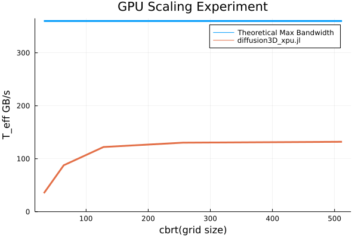

# Part 1: 3D multi-XPUs diffusion solver
Steady state solution of a diffusive process for given physical time steps using the pseudo-transient acceleration (using the so-called "dual-time" method).


## Intro
As the title suggests the goal of this part is to implement the 3D diffusion equation:


using a dual-time method where the physical time-derivative (dt) is defined as physical term and we use pseudo-time (&tau;) to iterate the solution:


We will also make use of acceleration/damping to enforce scaling of the pseudo-transient iterations, finding the optimal damping term in the process.

The next goal is to implement a version of this PDE solution that can run on multiple CPUs and/or GPUs, on a single Computer or even a distributed system. For this task we will make use of [ParallelStencil.jl](https://github.com/omlins/ParallelStencil.jl) which enables us to write code that can be deployed both on a CPU or a GPU (or short XPU). Also we will use [ImplicitGlobalGrid.jl](https://github.com/eth-cscs/ImplicitGlobalGrid.jl) for distributed parallelization (using MPI) of the XPU solution.

Using the different implementations we will then perform some performance test and also do some weak scaling experiments.

## Methods

### (Pseudo) Temporal Discretation
As previously stated, the goal is to solve the linear diffusion equation in 3 Dimensions:


And for solving this PDE, we are using the dual-time method where the physical time-derivative (dt) is defined as physical term and we use pseudo-time (&tau;) to iterate the solution:


Which implies the following (pseudo-time) discretisation:


For practical purposes we divide the solution into 3 steps. First we Calculate 'H_Res':


Since we use damping, we update 'dH/d&tau;' in the seccond step with a damping parameter (which we also have to optimize):


And in the last step we finally update H:


### Numerical Differentiation

We used the `FiniteDifferences3D` submodule from [ParallelStencil.jl](https://github.com/omlins/ParallelStencil.jl) for the numerical differentiation. Like the name suggests, this submodule provides numerical differentiation via the [Finite Differences Method](https://en.wikipedia.org/wiki/Finite_difference_method).

Here is an example of a pratial numerical derivation of `H` in direction `x`: 


Equivalently here is a pratial numerical 2nd derivation of `H` in direction `x`: 


Using this submodule provied us with the following abstraction:


And thus the 2nd derivative of `H` in direction `x` can be written as:


### Optimizations and Spatial Discretation
To optimize we will replace all divisions with inverse multiplications, since multiplication is much faster than division.
Also we will transform the equation so we get the least amount of operations possible. Ans precompute values where possible.
So lets look again at `ResH`:


And since we solve this Equation in 3 Dimentions, we get this equivalent formula:


Then we use the abstraction from the Numerical Differentiation Part to discretize the PDE in the spatial domain:


And now the optimizations described above are pretty straight forward:


### Solution approach

As the name "dual-time" suggests, we iterate over 2 types of times. The physical time and the pseudo time.
In this case the physical timestep and the total physical time is given by: `dt = 0.2` and `ttot = 1.0` (both in seconds).
So we iterate over the physical time and in each physical timestep `t` we iterate over the pseudo time &tau;: 


We iterate over the pseudo time until the L2-norm of the equation's residual `(norm(ResH)/sqrt(length(ResH))` is smaller then the absolute tolerance given by: `tol = 1e-8`. Then we increment `t` by `dt` and update H\^t with the value of H\^&tau; And if `t < ttot` we start the pseudo time loop again. Here is a code snippet of the time loop of the `diffusion3D_xpu.jl` implementation. Which illustrates this the best:

```julia 
t = 0.0; it = 0; ittot = 0
damp  = 1-29/nx # damping (this is a tuning parameter, dependent on e.g. grid resolution)

# Physical time loop
while t<ttot
    iter = 0; err = 2*tol
    # Pseudo-transient iteration
    while err>tol && iter<itMax
        # Step 1
        @parallel compute_ResH!(H, Hᵗ, ResH, D, _dt, D_dx², D_dy², D_dz²)
        # Step 2
        @parallel compute_dHdt!(ResH, dHdt, dHdt2, damp)
        dHdt, dHdt2 = dHdt2, dHdt # Pointer Swap
        # Step 3
        @parallel compute_H!(H2, H, dHdt, dτ)
        H, H2 = H2, H #Pointer Swap

        # Calculate L2 norm
        if (iter % nout == 0)
            err = norm(ResH)/sqrt(length(ResH))
        end

        iter += 1
    end
    ittot += iter; it += 1; t += dt
    Hᵗ .= H
    if isnan(err) error("NaN") end
end
```


### Hardware

The hardware used to perform all simultaions and scaling experiments:
  - CPU: Intel i7-11700 (Max. Memory Bandwidth	50 GB/s, 8Cores and 16 Threads)
  - GPU: NVIDIA GeForce RTX 3060 (Max. Memory Bandwidth	360 GB/s)

Except for the Multi GPU Experiment, where we used:
  - Multi-GPU Node: 4x NVIDIA GeForce Titan X (Max. Memory Bandwidth 480 GB/s)

## Results
Results section

### 3D diffusion
Report an animation of the 3D solution here and provide and concise description of the results. _Unleash your creativity to enhance the visual output._

**Dual Time Solution with grid size 32x32x32 - slice at z=16 - using CPU**


**Dual Time Solution with grid size 512x512x256 - slice at z=128 - using 4 Titan X**


### Performance
Briefly elaborate on performance measurement and assess whether you are compute or memory bound for the given physics on the targeted hardware.

#### Performance metric

We are using the [performance metric](https://github.com/omlins/ParallelStencil.jl#performance-metric) proposed in the [ParallelStencil.jl](https://github.com/omlins/ParallelStencil.jl) library.

In our case, the `A_eff` metric was calculated as follows:
```julia

ResH_bound = length(ResH) + length(H) + length(Hᵗ)                   # Memory access: write ResH and read H + Hᵗ
dHdt_bound = 2 * length(dHdt) + length(ResH)                         # Memory access: update dHdt and read ResH
H_bound = 2 * length(H) + length(dHdt)                               # Memory access: update H and read dHdt
A_eff = 1e-9 * (ResH_bound + dHdt_bound + H_bound) * sizeof(Float64) # Effective main memory access per iteration [GB]
)
```

#### CPU Performance

An Intel® Core™ i7-11700 (8C16T, T_peak=50GB/s [[1]](#1)) was used for the CPU performance benchmark.
We executed the `diffusion3D_benchmark_cpu.jl` 4 times, with 1, 4, 8 and 16 threads respectively. 


Executed with `julia -O3 --check-bounds=no -t 1 ./scripts-part1/diffusion3D_benchmark_cpu.jl`.


Executed with `julia -O3 --check-bounds=no -t 4 ./scripts-part1/diffusion3D_benchmark_cpu.jl`.


Executed with `julia -O3 --check-bounds=no -t 8 ./scripts-part1/diffusion3D_benchmark_cpu.jl`.


Executed with `julia -O3 --check-bounds=no -t 16 ./scripts-part1/diffusion3D_benchmark_cpu.jl`.


#### GPU Performance

An NVIDIA GeForce RTX 3060 (T_eff=360 GB/s, 199 GFLOPS (FP64) [[2]](#2)) was used for the GPU performance benchmark.
Using the `diffusion3D_benchmark_gpu.jl` script, also shows us the optimal local problem size, which we want to use later for the Multi GPU scaling experiment. In this case 256 looks like the optimal problem size.



Executed with `julia -O3 --check-bounds=no ./scripts-part1/diffusion3D_benchmark_gpu.jl`.


#### Weak scaling Experiment
Now that we have the optimal local problem size for a GPU, we will run a week scaling experiment using multiple GPUs. (in total 4 Titan X)
To assess the performance when scaling to multiple GPUs we created two plots:

|**Number of GPUs vs Effective memory throughput**|**Number of GPUs vs Parallel efficiency <br> ([time using n GPUs]/[time using 1 GPU])**|
|---|---|
|||

The plots were generated by executing the `diffusion3D_benchmark_multigpu.jl` script 4 times:
- `~/.julia/bin/mpiexecjl -n 1 julia --project -O3 --check-bounds=no ./scripts-part1/diffusion3D_benchmark_multigpu.jl`
- `~/.julia/bin/mpiexecjl -n 2 julia --project -O3 --check-bounds=no ./scripts-part1/diffusion3D_benchmark_multigpu.jl`
- `~/.julia/bin/mpiexecjl -n 3 julia --project -O3 --check-bounds=no ./scripts-part1/diffusion3D_benchmark_multigpu.jl`
- `~/.julia/bin/mpiexecjl -n 4 julia --project -O3 --check-bounds=no ./scripts-part1/diffusion3D_benchmark_multigpu.jl`


#### Work-precision diagrams
Provide a figure depicting convergence upon grid refinement; report the evolution of a value from the quantity you are diffusing for a specific location in the domain as function of numerical grid resolution. Potentially compare against analytical solution.

**Iterations to steady state vs Grid size**
<p align="center">
  
&nbsp;
  
</p>

**Value at domain point (5,5,5) vs Grid size**
<p align="center">
  
&nbsp;
  
</p>

**Tolerance vs Convergence Behaviour to well converged solution**
<p align="center">
  
&nbsp;
  
</p>

The plots were generated by executing the `diffusion3D_work_precision.jl` script: `julia --project -O3 --check-bounds=no ./scripts-part1/diffusion3D_work_precision.jl`.

Provide a figure reporting on the solution behaviour as function of the solver's tolerance. Report the relative error versus a well-converged problem for various tolerance-levels. 

## Discussion
Discuss and conclude on your results

## References
<a id="1">[1]</a> https://ark.intel.com/content/www/us/en/ark/products/212279/intel-core-i711700-processor-16m-cache-up-to-4-90-ghz.html

<a id="2">[2]</a> https://www.techpowerup.com/gpu-specs/geforce-rtx-3060.c3682
