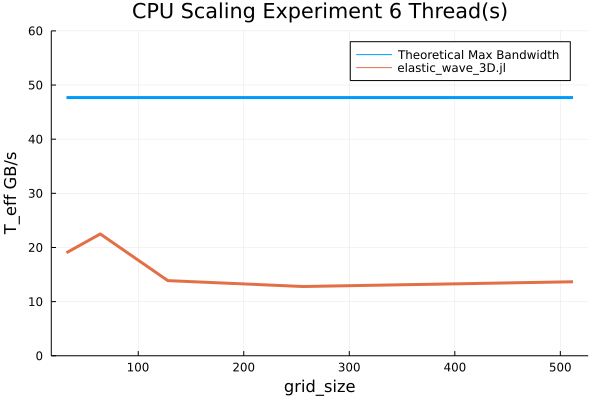

# Part 2: 3D XPU Elastic Waves Solver
Solving the 3D Navier-Cauchy equations for elastic waves on XPU using [ParallelStencil.jl](https://github.com/omlins/ParallelStencil.jl).


## Methods
As a starting point, we used `acoustic_2D_elast3.jl` from the final task of exercise 3 in [lecture 7](https://eth-vaw-glaciology.github.io/course-101-0250-00/lecture7/#towards_stokes_flow_i_acoustic_to_elastic).

To add a 3rd dimension, we added 1 new normal-stress component (τzz) and 2 new shear-stress components (τyz, τzx):
```julia
@all(τzz) = @all(τzz) + dt*(2.0*μ*(@d_zi(Vz)/dz) - 1.0/3.0*@inn_xy(∇V))
@all(τyz) = @all(τyz) + dt*μ*(@d_zi(Vy)/dz + @d_yi(Vz)/dy)
@all(τzx) = @all(τzx) + dt*μ*(@d_xi(Vz)/dx + @d_zi(Vx)/dz)

```
All the velocity calculations also had to be updated to incorporate the new components of the stress tensor:
``` julia
@inn(Vx) = @inn(Vx) - dt/ρ*(@d_xi(P)/dx - @d_xa(τxx)/dx - @d_ya(τxy)/dy - @d_za(τzx)/dz)
@inn(Vy) = @inn(Vy) - dt/ρ*(@d_yi(P)/dy - @d_ya(τyy)/dy - @d_za(τyz)/dz - @d_xa(τxy)/dx)
@inn(Vz) = @inn(Vz) - dt/ρ*(@d_zi(P)/dz - @d_za(τzz)/dz - @d_xa(τzx)/dx - @d_ya(τyz)/dy)
```
The only thing left then is to update `∇V`:
```julia
@all(∇V) = @d_xa(Vx)/dx + @d_ya(Vy)/dy + @d_za(Vz)/dz
```

## Results

For visualization, we took a 2D slice of the 3D pressure matrix `P` at `z=Lz/2`.


A resolution of 128x128x128 was used for the visualization. To replicate:

```
julia --project -O3 --check-bounds=no scripts-part2/elastic_wave_3D_visualize.jl
```

### Performance

#### Performance metric

We are using the [performance metric](https://github.com/omlins/ParallelStencil.jl#performance-metric) proposed in the [ParallelStencil.jl](https://github.com/omlins/ParallelStencil.jl) library.

In our case, the `A_eff` metric was calculated as follows:
```julia
# Effective main memory access per iteration [GB]
A_eff = 1e-9 * sizeof(Float64) * (
    2 * (length(τxx) + length(τyy) + length(τzz) + length(τxy) + length(τyz) + length(τzx))
  + 2 * (length(Vx)  + length(Vy)  + length(Vz))
  + 2 * (length(P))
)
```
`∇V` isn't included in the calculation as it is only used as a temporary.

#### CPU Performance

An AMD Ryzen 5 5600G (6C12T, T_peak=47.68 GB/s) was used for the CPU performance benchmark.



It is obvious from the graph that we are compute-bound for this problem on this particular CPU.

To run the CPU performance benchmark:
```
export JULIA_NUM_THREADS=<num_threads>
julia --project -O3 --check-bounds=no scripts-part2/elastic_wave_3D_benchmark_cpu.jl
```
Replace `<num_threads>` with the amount of physical cores in your CPU.
